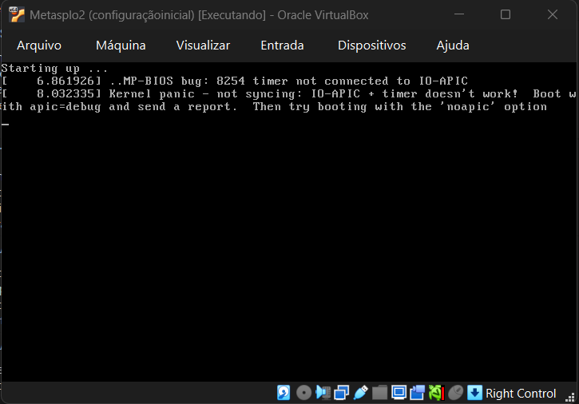

# 🚀 Meu Projeto do Desafio DIO: Aprendendo a usar o Medusa

Este repositório é o meu "diário de bordo" para o desafio de quebra de senhas da DIO. O objetivo era configurar um laboratório e aprender a usar a ferramenta Medusa para testes de força bruta. Aqui eu documentei meus passos, o que aprendi e os problemas que encontrei.

---

## ⚠️ Aviso de Ética: Meu Compromisso com o Hacking do Bem

Eu sei que essas ferramentas são poderosas. Por isso, quero deixar 100% claro que:

**Tudo o que você vê aqui foi feito em um ambiente de laboratório 100% controlado e seguro (o Oracle VirtualBox).**

As máquinas "atacadas" (Metasploitable 2 e DVWA) são feitas para isso. **Nenhum** site, computador ou rede real foi testado. Meu foco é aprender para defender sistemas, não para atacar.

---

## 1. 🔧 Montando o Laboratório (A Base de Tudo)

Para começar, precisei de um "ringue" seguro. Usei o Oracle VirtualBox para criar:

- **Máquina Atacante:** Kali Linux (Para rodar o Medusa)
- **Máquina Alvo:** Metasploitable 2 (O "saco de pancadas" vulnerável)

**Configuração de Rede:**
Eu configurei as duas máquinas em **"Rede Exclusiva de Hospedeiro" (Host-Only)**. Pelo que entendi, isso cria uma "bolha" onde as duas podem conversar, mas ficam isoladas da minha internet. 

- IP do Kali (Atacante): `192.168.56.103`
- IP do Metasploitable (Alvo): `192.168.56.104`

**Primeira Dificuldade (e Aprendizado!):**
Logo que liguei o Metasploitable 2, ele deu um erro de "Kernel Panic" (como na imagem abaixo).



Descobri que isso é comum e aprendi a corrigir: tive que reiniciar, apertar `'e'` na tela de boot (o GRUB) e adicionar `noapic` no final da linha do kernel. Isso fez o sistema ligar! 

---

## 2. ⚔️ Mão na Massa: Os Testes com Medusa

Antes de atacar, criei listas (`users.txt` e `pass.txt`) com algumas senhas e usuários óbvios (como `admin`, `msfadmin`, `password`...).

E para ter certeza dos serviços, usei o `nmap` primeiro:
`nmap -sV 192.168.56.104`

Isso me mostrou que as portas do FTP (21), HTTP (80) e SMB (445) estavam abertas e prontas para os testes.

### Teste 1: Atacando o FTP (Porta 21)

- **O que eu fiz?** Tentei adivinhar a senha do serviço de FTP.
- **Comando:**
    
    ```bash
    medusa -h 192.168.56.104 -U users.txt -P pass.txt -M ftp
    
    ```
    
- **O que aconteceu?**
O Medusa testou as combinações e sucesso, ele achou o login `msfadmin` com a senha `msfadmin`.
- **Prova (Screenshot):**
  
- **Como eu me defenderia disso?**
    1. Não usar senhas óbvias!
    2. Instalar um programa tipo "Fail2Ban", que bane o IP de quem errar a senha muitas vezes.

### Teste 2: Atacando um Login Web (DVWA na Porta 80)

- Simulei um ataque em uma página de login `login.php`. Tive que "ensinar" o Medusa a preencher o formulário.
- **Comando:**
    
    ```bash
    medusa -h 192.168.56.104 -U users.txt -P pass.txt -M http \\
    -m PAGE:'/dvwa/login.php' \\
    -m FORM:'username=^USER^&password=^PASS^&Login=Login' \\
    -m 'FAIL=Login failed'
    
    ```
    
- **O que aconteceu?**
O Medusa reportou 4 sucessos, mas ao analisar, percebi que 3 eram falsos positivos, pois o `FAIL` string não foi específico o suficiente. O login correto validado manualmente é login `admin` com a senha `password`.
- **Prova (Screenshot):**
  

### Teste 3: "Password Spraying" no SMB (Porta 445)

- **O que eu fiz?** Aqui a tática foi diferente. Em vez de 1000 senhas para 1 usuário, testei 1 senha  contra vários usuários.
- **Comando:** (Usei `msfadmin` como a senha-teste)
    
    ```bash
    medusa -h 192.168.56.104 -U users.txt -p 'msfadmin' -M smbnt
    
    ```
    
- **O que aconteceu?**
O Medusa mostrou que a senha `msfadmin` funcionava para o usuário `msfadmin`. Isso confirma que essa senha é fraca e reutilizada.
- **Prova (Screenshot):**
  
- **Como eu me defenderia disso?**
    1. Uma política de senhas que **proíbe** senhas óbvias.
    2. Monitorar a rede para ver se alguém está tentando logar em várias contas com a mesma senha.

---

## 3. 🎓 O que eu aprendi de verdade com esse desafio

- **O laboratório é muito importante:** Montar o ambiente é 50% do trabalho. E aprender a resolver problemas (como o `noapic`) faz parte do aprendizado.
- **Ferramentas se conectam:** O `nmap` acha a porta, o `enum4linux` (que usei antes) acha usuários, e o `medusa` testa as senhas.
- **O óbvio é perigoso:** `admin/password` ou `msfadmin/msfadmin` parecem inofensivos, mas é assim que muitas invasões começam.

Foi um ótimo desafio e meu primeiro passo prático em segurança.
